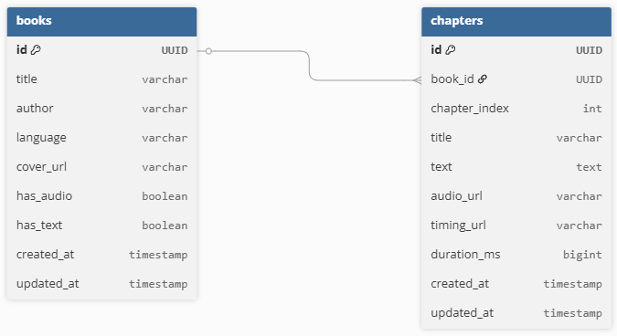

# 🎧 Kill-e 
- Сервис для чтения
- Слушайте аудиокниги и следите за текстом: подсветка синхронизируется с озвучкой!

## Оглавление
- [Требования](#требования)
- [Быстрый старт](#быстрый-старт)
- [Команды для управления](#команды-для-управления)
- [ENV-переменные](#env-переменные)

## Требования

- **Docker** (версия 20.10 или новее)  
- **Docker Compose** (версия 2.0 или новее)  

## Быстрый старт

```bash
git clone https://github.com/Gobzik/Kill-e.git
cd Kill-e
docker compose up --build
```
## Команды для управления

| Команда | Описание | Полезные флаги |
|:--------|:---------|:----------------|
| `docker compose up` | Запускает все сервисы | `-d` — фон<br>`--build` — пересобрать |
| `docker compose down` | Останавливает и удаляет контейнеры, сети | `-v` — **удалить тома с данными БД** ⚠️ |
| `docker ps` | Показывает запущенные контейнеры | `-a` — все (включая остановленные) |
| `docker logs <container>` | Показывает логи контейнера | `-f` — следить в реальном времени<br>`--tail 50` — последние 50 строк |


## ENV-переменные

### Для PostgreSQL

| Переменная | Описание | Пример       |
|------------|----------|--------------|
| POSTGRES_DB | Имя создаваемой БД | testdb       |
| POSTGRES_USER | Пользователь БД | testuser     |
| POSTGRES_PASSWORD | Пароль пользователя | testpassword |

---

### Для Spring Boot приложения

| Переменная | Описание | Значение по умолчанию |
|------------|----------|----------------------|
| SPRING_PROFILES_ACTIVE | Активный профиль Spring | docker |
| SPRING_DATASOURCE_URL | JDBC-строка подключения | jdbc:postgresql://postgres:5432/killedb |
| SPRING_DATASOURCE_USERNAME | Пользователь БД | killeuser |
| SPRING_DATASOURCE_PASSWORD | Пароль БД | killepass |
| SPRING_DATASOURCE_DRIVER_CLASS_NAME | JDBC-драйвер | org.postgresql.Driver |
| SPRING_JPA_HIBERNATE_DDL_AUTO | Стратегия миграции схемы | update |
| SPRING_JPA_PROPERTIES_HIBERNATE_DIALECT | Диалект Hibernate | org.hibernate.dialect.PostgreSQLDialect |

---

## Er диаграмма базы данных



