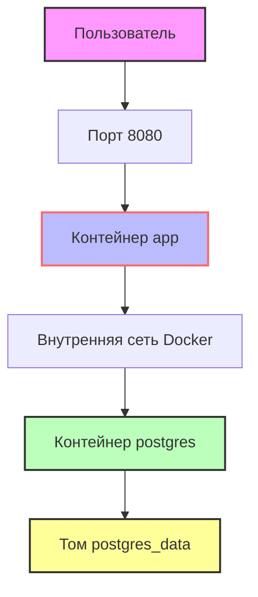

# 🎧 Kill-e 
- Сервис для чтения
- Слушайте аудиокниги и следите за текстом: подсветка синхронизируется с озвучкой!

## Оглавление
- [Требования](#требования)
- [Быстрый старт](#быстрый-старт)
- [Команды для управления](#команды-для-управления)
- [Схема работы приложения](#схема-работы-приложения)

## Требования

Перед началом убедитесь, что у вас установлены:
- **Docker** (версия 20.10 или новее)  
  Проверить: `docker --version`
- **Docker Compose** (версия 2.0 или новее)  
  Проверить: `docker compose version`

## Быстрый старт

Скопируйте репозиторий и запустите проект одной командой:
```bash
git clone https://github.com/Gobzik/Kill-e.git
cd Kill-e
docker-compose up –build
```

## Команды для управления

| Команда | Описание | Полезные флаги |
|:--------|:---------|:----------------|
| `docker-compose up` | Запускает все сервисы | `-d` — фон<br>`--build` — пересобрать |
| `docker-compose down` | Останавливает и удаляет контейнеры, сети | `-v` — **удалить тома с данными БД** ⚠️ |
| `docker ps` | Показывает запущенные контейнеры | `-a` — все (включая остановленные) |
| `docker logs <container>` | Показывает логи контейнера | `-f` — следить в реальном времени<br>`--tail 50` — последние 50 строк |


## Схема работы приложения




