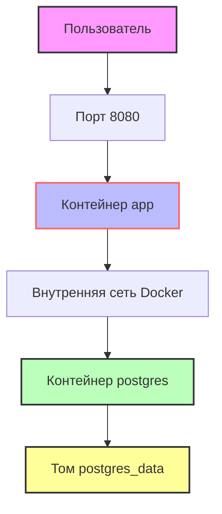

# 🎧 Kill-e 
- Сервис для чтения
- Слушайте аудиокниги и следите за текстом: подсветка синхронизируется с озвучкой!

## Оглавление
- [Требования](#требования)
- [Быстрый старт](#быстрый-старт)
- [Команды для управления](#команды-для-управления)
- [Схема работы приложения](#схема-работы-приложения)
- [Разбор по шагам Dockerfile](#разбор-по-шагам-dockerfile)
- [Разбор секций docker-compose.yml](#разбор-секций-docker-composeyml)
- [ENV-переменные](#env-переменные)

## Требования

Перед началом убедитесь, что у вас установлены:
- **Docker** (версия 20.10 или новее)  
  Проверить: `docker --version`
- **Docker Compose** (версия 2.0 или новее)  
  Проверить: `docker compose version`

## Быстрый старт

Скопируйте репозиторий и запустите проект одной командой:
```bash
git clone https://github.com/Gobzik/Kill-e.git
cd Kill-e
docker compose up --build
```

## Команды для управления

| Команда | Описание | Полезные флаги |
|:--------|:---------|:----------------|
| `docker compose up` | Запускает все сервисы | `-d` — фон<br>`--build` — пересобрать |
| `docker compose down` | Останавливает и удаляет контейнеры, сети | `-v` — **удалить тома с данными БД** ⚠️ |
| `docker ps` | Показывает запущенные контейнеры | `-a` — все (включая остановленные) |
| `docker logs <container>` | Показывает логи контейнера | `-f` — следить в реальном времени<br>`--tail 50` — последние 50 строк |


## Схема работы приложения


## Разбор по шагам Dockerfile
```dockerfile
# ========== ЭТАП 1: СБОРЩИК (BUILDER) ==========
# Берем готовый образ с Gradle для сборки проекта
FROM bitnami/gradle:latest AS builder

# Переключаемся на root для установки дополнительных пакетов
USER root

# Устанавливаем менеджер пакетов wget (чтобы скачать JDK)
RUN install_packages wget

# Скачиваем и устанавливаем JDK 24 (для архитектуры ARM64, например Apple Silicon)
RUN wget https://download.java.net/java/GA/jdk24/.../openjdk-24_linux-aarch64_bin.tar.gz && \
    tar -xzf openjdk-24_linux-aarch64_bin.tar.gz && \
    mv jdk-24 /opt/jdk-24 && \
    rm openjdk-24_linux-aarch64_bin.tar.gz

# Указываем, какую Java использовать
ENV JAVA_HOME=/opt/jdk-24
ENV PATH=$JAVA_HOME/bin:$PATH

# Создаем рабочую директорию внутри контейнера
WORKDIR /app

# Копируем файлы конфигурации Gradle и исходный код
COPY build.gradle.kts settings.gradle.kts ./
COPY gradle ./gradle
COPY src ./src

# Собираем проект, пропуская тесты (чтобы ускорить сборку)
RUN gradle clean build --no-daemon -x test

# ========== ЭТАП 2: ФИНАЛЬНЫЙ ОБРАЗ (ДЛЯ ЗАПУСКА) ==========
# Снова используем образ с Gradle, но только как основу
FROM bitnami/gradle:latest

USER root
# Удаляем встроенный Gradle, он нам не нужен в финальном образе
RUN rm -rf /opt/bitnami/gradle

# Копируем установленную JDK из первого этапа (builder)
COPY --from=builder /opt/jdk-24 /opt/jdk-24

# Снова прописываем пути к Java
ENV JAVA_HOME=/opt/jdk-24
ENV PATH=$JAVA_HOME/bin:$PATH

WORKDIR /app

# Создаем непривилегированного пользователя для безопасности
RUN groupadd -r appuser && useradd -r -g appuser appuser

# Копируем собранный JAR-файл из первого этапа
COPY --from=builder /app/build/libs/*.jar app.jar

# Переключаемся на обычного пользователя (теперь root не используется)
USER appuser

# Указываем, что приложение слушает порт 8080
EXPOSE 8080

# Команда для запуска приложения
ENTRYPOINT ["java", "-jar", "app.jar"]
```
## Разбор секций docker-compose.yml

### Сервис postgres

| Секция | Значение | Зачем нужно |
|--------|----------|-------------|
| image: postgres:16-alpine | Официальный образ PostgreSQL 16 на Alpine Linux | Минимальный размер (~50 МБ) + безопасность |
| container_name: kille-postgres | Фиксированное имя контейнера | Удобство: docker logs kille-postgres |
| environment | Переменные для инициализации БД | Создаёт БД, пользователя и пароль при первом запуске |
| ports: "5432:5432" | Проброс порта на хост | Доступ к БД извне (для отладки, не для prod!) |
| volumes: postgres_data | Постоянное хранилище | Данные сохраняются после перезапуска контейнера |
| healthcheck | Проверка готовности БД | pg_isready гарантирует, что app не стартует раньше БД |
| networks: kille-network | Изолированная сеть | Контейнеры видят друг друга по именам сервисов |

### Сервис app (Spring-приложение)

| Секция | Значение | Зачем нужно |
|--------|----------|-------------|
| build.context + dockerfile | Путь к Dockerfile | Сборка образа из исходников проекта |
| container_name: kille-app | Фиксированное имя контейнера | Удобство логирования и мониторинга |
| environment | Переменные для Spring Boot | Настройка подключения к БД и профиля |
| ports: "8080:8080" | Проброс порта приложения | Доступ к API: http://localhost:8080 |
| depends_on.condition: service_healthy | Ждёт healthy-статус postgres | Гарантирует, что БД готова до старта приложения ✅ |
| networks: kille-network | Та же сеть, что у postgres | Приложение резолвит postgres как hostname |
| restart: unless-stopped | Автоперезапуск при сбоях | Повышает отказоустойчивость |

### Секции volumes и networks

#### volumes:
  postgres_data:  # Docker создаёт managed volume автоматически

#### networks:
  kille-network:
    driver: bridge  # Стандартная изолированная сеть Docker
---

## ENV-переменные

### Для PostgreSQL

| Переменная | Описание | Пример |
|------------|----------|--------|
| POSTGRES_DB | Имя создаваемой БД | killedb |
| POSTGRES_USER | Пользователь БД | killeuser |
| POSTGRES_PASSWORD | Пароль пользователя | killepass |

> ⚠️ В production используйте Docker Secrets или .env-файл, добавленный в .gitignore!

---

### Для Spring Boot приложения

| Переменная | Описание | Значение по умолчанию |
|------------|----------|----------------------|
| SPRING_PROFILES_ACTIVE | Активный профиль Spring | docker |
| SPRING_DATASOURCE_URL | JDBC-строка подключения | jdbc:postgresql://postgres:5432/killedb |
| SPRING_DATASOURCE_USERNAME | Пользователь БД | killeuser |
| SPRING_DATASOURCE_PASSWORD | Пароль БД | killepass |
| SPRING_DATASOURCE_DRIVER_CLASS_NAME | JDBC-драйвер | org.postgresql.Driver |
| SPRING_JPA_HIBERNATE_DDL_AUTO | Стратегия миграции схемы | update |
| SPRING_JPA_PROPERTIES_HIBERNATE_DIALECT | Диалект Hibernate | org.hibernate.dialect.PostgreSQLDialect |

---

